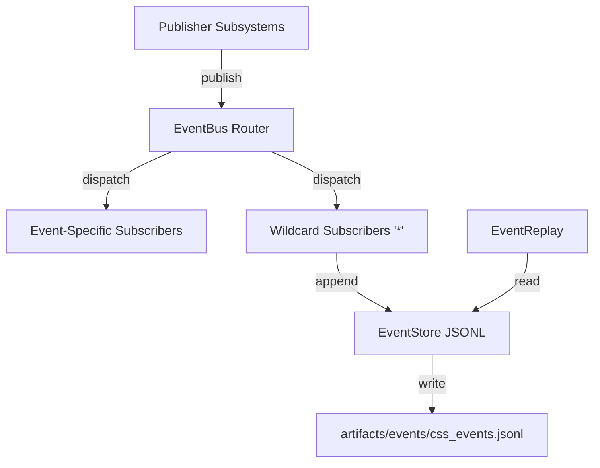

# EIP-1 Enterprise Event Bus Foundation (Scaffolding Phase)

This document covers the architecture, design patterns, public API, persistence scheme, and testing strategy for the EIP-1 Enterprise Event Bus scaffolding.

## 1. Architectural Overview

The Enterprise Event Bus provides a standardized, asynchronous publisher-subscriber messaging framework for CSS. It enables decoupling of modules (e.g., Risk, Capital, Orders, Notifications) without direct compile-time or runtime dependencies.



The system relies on synchronous delivery to registered callbacks in a thread-safe, isolated manner. Key guarantees:
* **Isolation:** A failing callback does not interrupt other callbacks from receiving the published event.
* **Ordering:** Callbacks are triggered in registration order (deterministic).
* **Decoupling:** Subsystems trigger actions by publishing standard events; listeners act independently.

## 2. Event Schema (Data Model)

The Event model is defined as a dataclass in `backend/events/event_models.py`.

### Attributes
| Field Name | Type | Description |
| :--- | :--- | :--- |
| `event_id` | `str` | A unique UUIDv4 string generated automatically. |
| `timestamp` | `float` | The epoch time when the event was constructed. |
| `event_type` | `str` | The specific uppercase event type from the registry. |
| `severity` | `str` | The severity level (DEBUG, INFO, WARNING, ERROR, CRITICAL). |
| `category` | `str` | The category group (ORDER, SYSTEM, RISK, etc.). |
| `source` | `str` | Subsystem generating the event (e.g. `execution_router`). |
| `payload` | `dict` | JSON-serializable structured payload data. |
| `correlation_id` | `str` (Optional) | Transaction correlation identifier. |
| `session_id` | `str` (Optional) | Execution session key. |
| `user_id` | `str` (Optional) | User identifier. |
| `schema_version` | `str` | Format specification, defaults to `"1.0.0"`. |

## 3. Event Registry

A centralized list of event types is housed under `backend/events/event_registry.py`. Developers must use these constants to avoid hardcoding names across the repository.

Examples:
* `ORDER_CREATED`, `ORDER_FILLED`, `ORDER_CANCELLED`
* `RISK_LIMIT_EXCEEDED`, `RISK_CHECK_PASSED`, `RISK_CHECK_FAILED`
* `SYSTEM_STARTUP`, `SYSTEM_SHUTDOWN`

## 4. Public API

### Publisher
```python
from backend import events

event = events.Event(
    event_type=events.ORDER_CREATED,
    severity=events.SEVERITY_INFO,
    category=events.CATEGORY_ORDER,
    source="execution_engine",
    payload={"symbol": "AAPL", "qty": 10}
)
delivered_count = events.publish(event)
```

### Subscriber
```python
from backend import events

def my_callback(event: events.Event):
    print(f"Received: {event.event_type} - {event.payload}")

# Subscribe to a specific type
events.subscribe(events.ORDER_CREATED, my_callback)

# Subscribe to all events
events.subscribe("*", my_callback)

# Unsubscribe
events.unsubscribe(events.ORDER_CREATED, my_callback)
```

## 5. Persistence Format

Events are persisted to `artifacts/events/css_events.jsonl` in append-only JSON Lines format.

Each line contains a complete JSON-serialized event object. Example:
```json
{"event_type": "ORDER_CREATED", "severity": "INFO", "category": "ORDER", "source": "test", "payload": {}, "event_id": "...", "timestamp": 1782782392.21, "correlation_id": null, "session_id": null, "user_id": null, "schema_version": "1.0.0"}
```

## 6. Replay & Filtering

Replay functions read historical events sequentially from the store and support querying by type, category, or correlation ID.

```python
from backend.events import get_default_replay

replay_engine = get_default_replay()

# Replay all events of category ORDER
order_history = replay_engine.replay(category=events.CATEGORY_ORDER)

# Replay by correlation ID
corr_history = replay_engine.replay(correlation_id="corr-123")
```

## 7. Testing

A complete test suite is available at `tests/test_enterprise_event_bus.py`. Run tests using:

```powershell
python -m pytest tests/test_enterprise_event_bus.py
```
