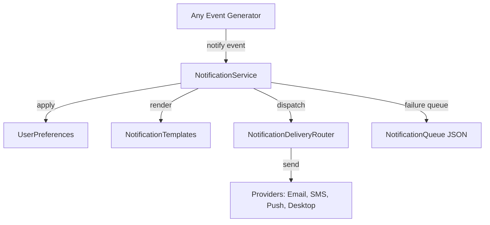

# Enterprise Notification Framework (EWP-1.A Foundation)

This document covers the architecture, interfaces, and integration details for the Enterprise Notification Framework scaffolding.

## 1. Architecture

The Notification Framework exposes a single orchestrator service: `NotificationService`. It relies on user preferences (enabled channels, quiet hours filters), templates, and a persistent queue for retries.



## 2. Event Model Standard (Standard #1)

All messages are encapsulated strictly within the canonical `Event` model defined in `backend/events`. Notification parameters are stored inside the `payload` dictionary of the Event:
* `payload["title"]`: Short alert title.
* `payload["message"]`: Complete formatted notification message.
* `payload["delivery_channels"]`: Target channels list (e.g., `["email", "push"]`).
* `payload["retry_count"]`: Number of delivery retry iterations.
* `payload["delivery_status"]`: Status of this dispatch (`PENDING`, `SENT`, `RETRYING`, `FAILED`).

## 3. Public API

### Configuration
Exposed via the `NotificationConfig` dataclass:
```python
from backend.notifications import NotificationConfig

config = NotificationConfig(
    max_retries=3,
    default_channels=["email", "desktop"]
)
```

### Notification Service
```python
from backend.notifications import NotificationService

service = NotificationService(
    config=config,
    queue=queue,
    history=history,
    router=router,
    templates=templates,
    scheduler=scheduler
)

# Dispatch event notification
service.notify(event)
```

## 4. Persistent Formats and Hardening (EWP-1A)

Standard persistence APIs are used (`load()`, `save()`, `append()`, `clear()`) which utilize the thread-safe persistence helper library (`backend/common/persistence`).

### Shared Enterprise Standards
* **Serialization Standard:** Reuses `JSONSerializable` mixin:
  - `to_dict()` and `from_dict(data)`
  - `to_json()` and `from_json(json_str)`
* **Schema Versioning:** Every notification record written contains `schema_version` (default `"1.0.0"`), checked via `validate_schema_version()`.
* **Input Validation:** Enforced via `validate_required_fields()` and `validate_field_type()`. If required values are malformed or missing, `ValidationException` is raised.
* **Logging System:** Employs the centralized `CSSLogger` (`get_logger("css.notifications.service")`).
* **Exception Hierarchy:** Inherits from standard CSS base exception:
  - `CSSException` -> `NotificationException`, `ValidationException`, `PersistenceException`, `ConfigurationException`

## 5. Verification

Run the test suite using:
```powershell
python -m pytest tests/test_notification_framework.py
```
