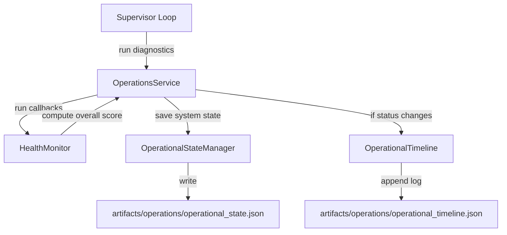

# Operations Control Centre Foundation (EWP-1.C)

This document covers the architecture, interfaces, and integration details for the Operations Control Centre (OCC) Foundation scaffolding.

## 1. Architecture

The Operations Control Centre exposes a single orchestrator service: `OperationsService`. It manages health checkers, calculates weighted overall health scores, updates persistent status states, logs state transitions on a timeline, and accumulates runtime throughput statistics.



## 2. Event Model Standard (Standard #1)

All diagnostic outputs are represented using the canonical `Event` model defined in `backend/events`:
1. **Component Health Check Result:** Event type `HEALTH_CHECK_RESULT`, severity maps status (INFO, WARNING, CRITICAL), category `SYSTEM`.
   * `payload["component"]`: Component identifier (e.g. database).
   * `payload["status"]`: Status code (OK, WARN, CRITICAL).
   * `payload["latency_ms"]`: Measurement check latency.
2. **System State Snapshot:** Event type `SYSTEM_STATE_SNAPSHOT`, severity maps overall status, category `SYSTEM`.
   * `payload["overall_status"]`: Status code (HEALTHY, DEGRADED, CRITICAL).
   * `payload["health_score"]`: Value between 0.0 and 100.0.
   * `payload["component_states"]`: Dict mapping component statuses.
3. **Timeline Event:** Event type `TIMELINE_EVENT`, category `SYSTEM`.
   * `payload["timeline_event_type"]`: Sub-classification (STATE_CHANGE, HEARTBEAT, ALERT).
   * `payload["message"]`: Description summary.

## 3. Public API

### Configuration
Exposed via the `OperationsConfig` dataclass:
```python
from backend.operations import OperationsConfig

config = OperationsConfig(default_source="operations_service")
```

### Operations Service
```python
from backend.operations import OperationsService

service = OperationsService(
    config=config,
    monitor=monitor,
    state_manager=state_manager,
    timeline=timeline,
    statistics=statistics
)

# Run system diagnostic checklist
state_event = service.run_diagnostics()
```

## 4. Persistent Formats

Standard persistence APIs are used (`load()`, `save()`, `append()`, `clear()`).

* **System State Snapshot:** `artifacts/operations/operational_state.json`
* **Chronological Timeline Logs:** `artifacts/operations/operational_timeline.json`

## 5. Verification

Run the test suite using:
```powershell
python -m pytest tests/test_operations_control_centre.py
```
