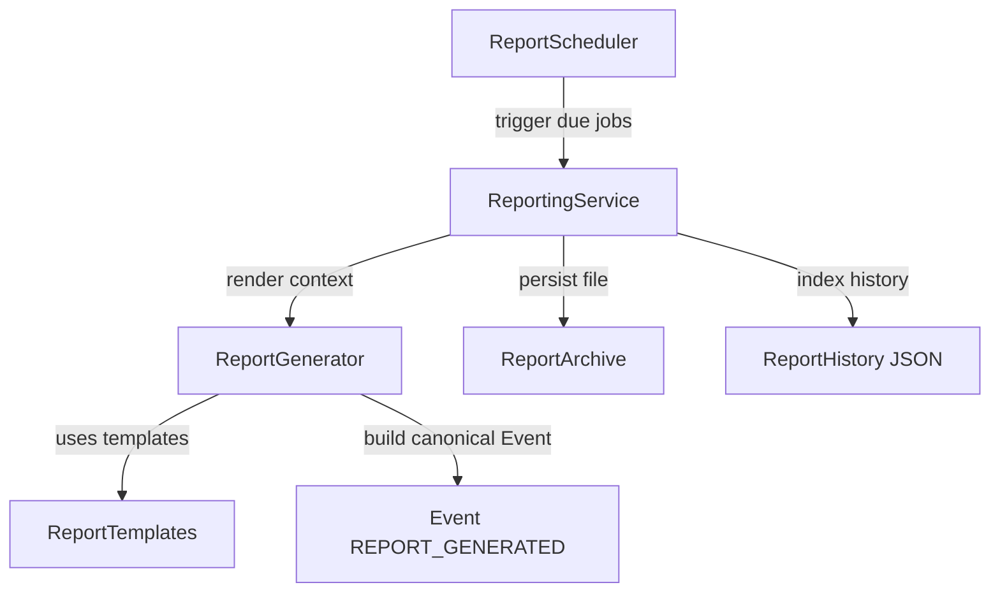

# Enterprise Reporting Framework (EWP-1.B Foundation)

This document covers the architecture, interfaces, and integration details for the Enterprise Reporting Framework scaffolding.

## 1. Architecture

The Reporting Framework exposes a single orchestrator service: `ReportingService`. It uses report templates, generates text-based reports from raw variables, archives completed reports, and manages job schedules.



## 2. Event Model Standard (Standard #1)

All generated reports are structured as canonical `Event` objects of type `REPORT_GENERATED` with severity `INFO` and category `METRICS`. Report contents are mapped inside the `payload` dictionary of the Event:
* `payload["report_type"]`: Type code (DAILY, WEEKLY, MONTHLY, RUNTIME, PORTFOLIO, RISK).
* `payload["title"]`: Descriptive report title.
* `payload["content"]`: Text content of the generated report.
* `payload["custom_metadata"]`: Structured context details.

## 3. Public API

### Configuration
Exposed via the `ReportingConfig` dataclass:
```python
from backend.reporting import ReportingConfig

config = ReportingConfig(default_source="reporting_service")
```

### Reporting Service
```python
from backend.reporting import ReportingService

service = ReportingService(
    config=config,
    generator=generator,
    archive=archive,
    history=history,
    scheduler=scheduler
)

# Render and write report
service.create_report(
    report_type="DAILY",
    title="Daily Performance Summary",
    context=context
)
```

## 4. Persistent Formats

Standard persistence APIs are used (`load()`, `save()`, `append()`, `clear()`).

* **Individual Archive Files:** `artifacts/reports/report_{report_id}.json`
* **History Manifest Index:** `artifacts/reports/report_history.json`

## 5. Verification

Run the test suite using:
```powershell
python -m pytest tests/test_reporting_framework.py
```
