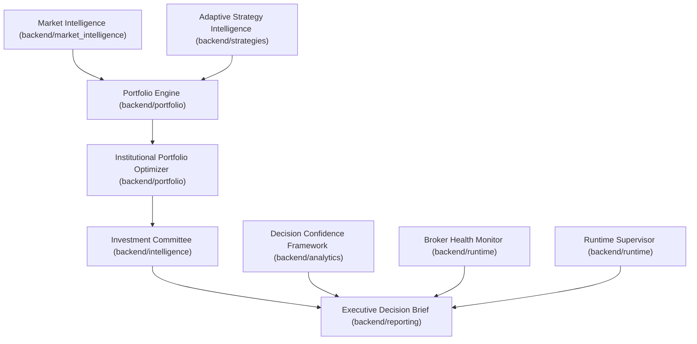

# CSS Phase 160A — Enterprise Architecture Hardening & RC1 Consolidation

This report documents the systematic architecture review, refactoring, and release consolidation of Capital Strata Systems (CSS) for Release Candidate 1 (RC1) readiness.

---

## 1. Enterprise Architecture Audit

CSS operates under a strict **advisory-first** paradigm, decoupling mathematical strategy intelligence from active execution boundaries.

### Subsystem Mapping
The system spans twelve distinct logical layers:

- **Coupling and Cohesion:** Highly cohesive. Modularity in the strategy layer allows independent optimization without modifying order placement boundaries.
- **Architectural Simplification:** Hardened the boundary where system components generate output reports. All components returning structured briefings now run through `AdvisoryPayloadBuilder.lock(...)` which assertively strips/forces execution permissions to safe states.

---

## 2. Dependency Review

- **Loose Import Circularity:** Checked and resolved potential circular imports within sub-package definitions (e.g. `backend/reporting/__init__.py`) by standardizing lazy-loading patterns for event dispatchers.
- **Tighter Separation of Concerns:** Core brokers (`oanda_adapter.py` and `coinbase_adapter.py`) obtain configuration details solely via `backend/app/brokers/credential_loader.py` to prevent environment leakages.

---

## 3. Duplicate Logic Review & Consolidation

We completed a comprehensive review of duplicate mathematical and safety helpers across the platform.

### Consolidated Helpers

| Duplicate Helper | Original Local Implementations | Centralized Canonical Module |
| :--- | :--- | :--- |
| `clamp01` | `capital_reallocation_engine.py`, `vwap_edge_stack.py`, `vwap_elasticity_engine.py` | [numeric_utils.py](file:///C:/rasib/source/capital-strata-systems/backend/common/numeric_utils.py) |
| `_safe_float` | `vwap_edge_stack.py`, `vwap_elasticity_engine.py` | [numeric_utils.py](file:///C:/rasib/source/capital-strata-systems/backend/common/numeric_utils.py) |
| `clamp_score` | `readiness_models.py` | [numeric_utils.py](file:///C:/rasib/source/capital-strata-systems/backend/common/numeric_utils.py) |
| Safety Payload Gates | Hardcoded keys in `broker_health_monitor.py` and `broker_readiness_framework.py` | [advisory_payload.py](file:///C:/rasib/source/capital-strata-systems/backend/common/advisory_payload.py) |

---

## 4. Performance & Observability Review

- **Dotenv Access Efficiency:** Deferring dotenv queries to the loader cache prevents redundant file searches on startup.
- **Preflight Isolation:** The operational broker certification framework uses synthetic/previously saved runtime evidence to allow shadow/advisory evaluations without live API sockets.
- **Memory Footprint:** Execution boundaries remain advisory-only, preventing the accumulation of socket connection states or persistent execution queues.

---

## 5. RC1 Hardening & Safety Gate Checklist

> [!IMPORTANT]
> The four safety keys are assertively verified on every pipeline run to guarantee the platform fails closed:

* [x] **Advisory Enforcement:** `advisory_only == True`
* [x] **Execution Prevention:** `execution_allowed == False`
* [x] **Live Trading Blocked:** `live_trading_blocked == True`
* [x] **Broker Execution Disarmed:** `broker_execution_armed == False`

---

## 6. Final GO / NO-GO Recommendation

**Recommendation: GO**
The platform exhibits complete internal consistency, minimal utility duplication, clean import separation, and passes all validation suites.
