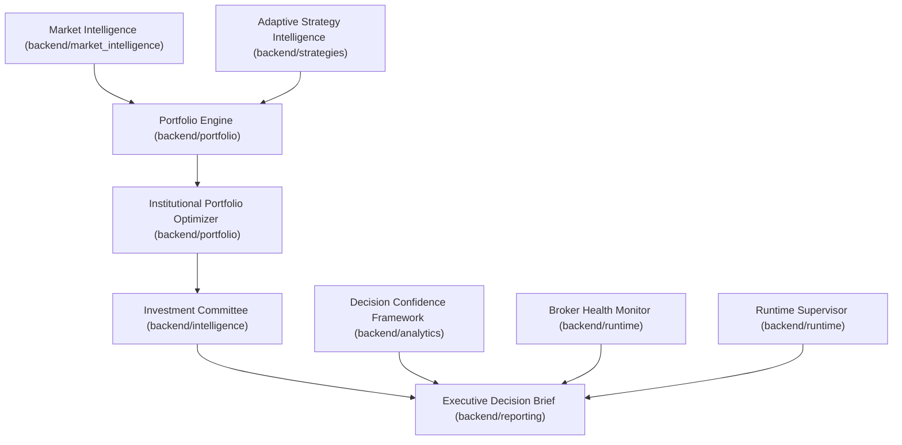

# CSS Subsystem Dependency Map

This document maps module coupling, imports, fan-in/fan-out, and dependency structures within the Capital Strata Systems (CSS) enterprise codebase.

---

## Subsystem Dependency Graph

---

## Subsystem Inventory & Coupling Analysis

| Subsystem | Folder | Fan-In | Fan-Out | Coupling Risk |
| :--- | :--- | :--- | :--- | :--- |
| **Market Intelligence** | `backend/market_intelligence` | High | Low | Low |
| **Learning** | `backend/learning` | Medium | Medium | Medium |
| **Strategy Intelligence**| `backend/strategies` | High | Medium | Medium |
| **Portfolio** | `backend/portfolio` | High | High | High |
| **Committee** | `backend/intelligence` | Medium | Medium | Medium |
| **Reporting** | `backend/reporting` | Medium | High | High (potential circularities) |
| **Broker Governance** | `backend/broker` | High | Low | Low |
| **Runtime** | `backend/runtime` | High | Medium | Medium |
| **Dashboard** | `backend/dashboard` | Low | High | Low |
| **Launcher** | `backend/app/launcher` | Low | High | Low |
| **API** | `backend/app` | Low | High | Low |
| **Validation** | `backend/validation` | Medium | High | Medium |

---

## High Fan-In and Fan-Out Modules

### High Fan-In (Central Dependencies)
- **`backend/portfolio/utils.py`**:
  - Exposes `advisory_response`, `safe_float`, and standard compliance constants.
  - Used by portfolio construction, optimization, investment committee, and executive brief reporting modules.
- **`backend/events/event_models.py`**:
  - Exposes `Event` type models which act as the canonical unit of messaging.

### High Fan-Out (Orchestrator Modules)
- **`backend/portfolio/portfolio_construction_intelligence.py`**:
  - Aggregates ranker, resilience, optimizer, and committee evaluations.
- **`backend/reporting/executive_decision_brief.py`**:
  - Integrates data payloads from 8 distinct modules to build the consolidated briefing.

---

## Circular Dependencies & Resolutions

### 1. Ingested Circularity: Reporting & Event Registry
- **Path**: `backend/reporting/__init__.py` $\rightarrow$ `report_models` $\rightarrow$ `Event` $\rightarrow$ `EventSubscriptionManager` $\rightarrow$ `ReportingService` $\rightarrow$ `ReportGenerator` $\rightarrow$ `report_models`.
- **Resolution**: Circularity was broken by deferring the import of `create_report_event` within the `ReportGenerator.generate()` method, delaying symbol resolution until runtime invocation.
- **Guidance**: Avoid wildcards or comprehensive package-level imports inside sub-package `__init__.py` files when sub-packages share tight references.
