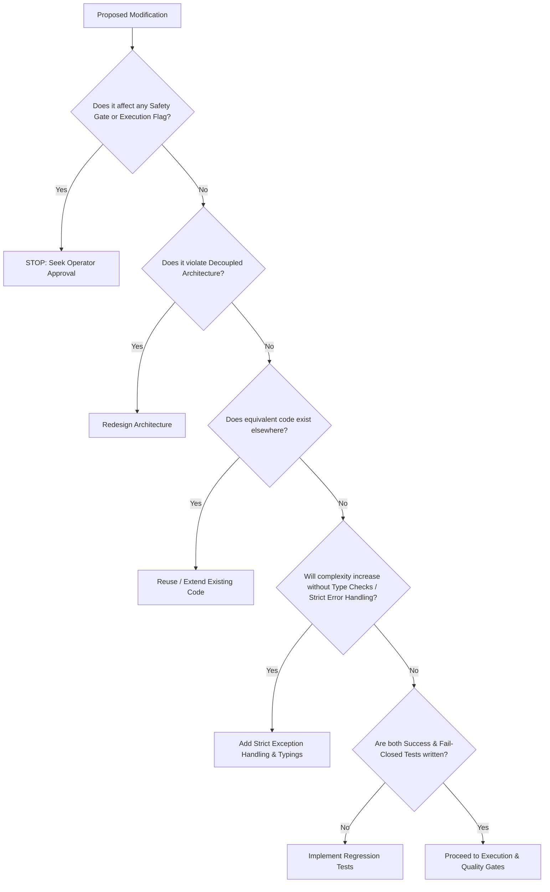

# Capital Strata Systems Master Autonomous Engineering Protocol (MAEP)
## Document Version: 0.2.0
## Classification: Internal Governance & Operating Standard

---

## Table of Contents
1. [Mission Statement](#1-mission-statement)
2. [CSS Engineering Philosophy](#2-css-engineering-philosophy)
3. [Institutional Software Engineering Standards](#3-institutional-software-engineering-standards)
4. [Architecture Preservation Principles](#4-architecture-preservation-principles)
5. [Autonomous Decision Authority](#5-autonomous-decision-authority)
6. [Mandatory Stop Conditions](#6-mandatory-stop-conditions)
7. [Git Workflow](#7-git-workflow)
8. [Laptop1 / Desktop Development & Runtime Isolation](#8-laptop1--desktop-development--runtime-isolation)
9. [Testing Standards](#9-testing-standards)
10. [Documentation Standards](#10-documentation-standards)
11. [Logging Standards](#11-logging-standards)
12. [Runtime Validation Standards](#12-runtime-validation-standards)
13. [Broker Safety Rules](#13-broker-safety-rules)
14. [Security Standards](#14-security-standards)
15. [Performance Standards](#15-performance-standards)
16. [Refactoring Rules](#16-refactoring-rules)
17. [Code Review Checklist](#17-code-review-checklist)
18. [Completion Report Standard](#18-completion-report-standard)
19. [Agent Behaviour Rules](#19-agent-behaviour-rules)
20. [Forbidden Actions](#20-forbidden-actions)
21. [Engineering Quality Gates](#21-engineering-quality-gates)
22. [Production Certification Checklist](#22-production-certification-checklist)
23. [Future Expansion Guidelines](#23-future-expansion-guidelines)
24. [CSS Constitutional Principles](#24-css-constitutional-principles)
25. [Canonical Sources of Truth](#25-canonical-sources-of-truth)
26. [Engineering Decision Framework](#26-engineering-decision-framework)
27. [Institutional Coding Standards](#27-institutional-coding-standards)
28. [Repository Learning Model](#28-repository-learning-model)
29. [Multi-Agent Collaboration](#29-multi-agent-collaboration)
30. [Institutional Vocabulary](#30-institutional-vocabulary)
31. [Engineering Review Board](#31-engineering-review-board)
32. [Repository Preservation Policy](#32-repository-preservation-policy)
33. [Continuous Improvement](#33-continuous-improvement)
34. [AI Memory Expectations](#34-ai-memory-expectations)
35. [Future Governance Roadmap](#35-future-governance-roadmap)

---

### 1. Mission Statement
The Capital Strata Systems Master Autonomous Engineering Protocol (MAEP) establishes the canonical engineering operating standard for all autonomous coding agents (including Antigravity, Codex, and successors). The mission is to ensure absolute safety, structural consistency, and predictability of the CSS codebase, maximizing autonomous execution efficiency while enforcing institutional-grade, fail-closed risk controls.

### 2. CSS Engineering Philosophy
* **Fail-Closed Design:** Every system, component, and integration must revert to a blocked, read-only, or disabled execution state when an anomaly, validation failure, or environment discrepancy is encountered.
* **Defensive Engineering:** Assume that inputs, configurations, network resources, and external broker states will fail, drift, or contaminate the environment. Guard all entry points.
* **Explicit Over Implicit:** Prefer explicit code flows, declarative status updates, and clear error pathways over implicit inheritance, magic parameters, or hidden defaults.

### 3. Institutional Software Engineering Standards
* **Strong Typing & Checking:** Code must declare types, return types, and follow standard Python guidelines (PEP 8).
* **Deterministic Behavior:** Avoid race conditions, thread-unsafe structures, or mutable module-level state.
* **Strict Error Handling:** Never catch generic exceptions silently. Catch specific Exceptions, log detail, and bubble up failures to the authoritative state engine.

### 4. Architecture Preservation Principles
* **Decoupled Architecture:** Preserve the strict separation between the console dashboard (`scripts/css_live_dashboard.py`), the core backend runtime (`backend/runtime/`), and the broker integration wrappers.
* **Authoritative State Parity:** Ensure all components query a single canonical source of truth for broker accounts, margin calculations, and execution decisions. Stale locally-nested statuses are prohibited.

### 5. Autonomous Decision Authority
Coding agents are empowered to decide the following autonomously:
* **Local Refactoring:** Optimizing performance, code layout, or readability within existing module scopes.
* **Mock & Test Architecture:** Designing new unit tests, mock feeds, and verification tests.
* **Internal Logic Details:** Writing utility algorithms, helper classes, and parsing methods.
* **Bug Remediation:** Fixing syntactical errors, exception handles, and localized type mismatches.

### 6. Mandatory Stop Conditions
Agents MUST stop and request human operator intervention if:
1. **Credentials & Secrets:** Access credentials, keys, or external secure API configs are missing.
2. **Safeguard Degradation:** A change would weaken or alter any trading, safety, risk, or compliance control.
3. **Destructive Actions:** A task requires database truncations, file deletions, or resetting Git branches.
4. **Architectural Divergence:** Resolving a requirement requires choices with conflicting long-term design patterns.

### 7. Git Workflow
* **Branch Policy:** All features and hotfixes must proceed on branches derived from production release candidates (e.g., `css-evening-consolidation-*`).
* **Commit Standards:** Commits must be atomic, descriptive, and reference the phase being resolved (e.g., `feat(phase163b3j): consolidate state authority`).
* **Push/Merge/Recovery Policy:** Never force-push or reset remote branches. Merges must resolve cleanly. If a merge conflict occurs, abort and verify.

### 8. Laptop1 / Desktop Development & Runtime Isolation
* **Laptop1 (Development):** The exclusive workspace for planning, writing code, executing unit tests, and compiling documentation.
* **Desktop (Runtime/Server):** The production runtime server. No code editing, testing, or Git manipulation may occur on the Desktop machine. Code is synced to the Desktop only when certified on Laptop1.

### 9. Testing Standards
* **Regression Testing:** Every modification must run the entire pytest test suite (113+ tests) and maintain a 100% pass rate.
* **Coverage Requirements:** New modules must include corresponding test suites under `tests/`. Mocks must replicate both successful and failed execution modes.

### 10. Documentation Standards
* **Artifact Integrity:** Keep `walkthrough.md`, `task.md`, and project readmes updated.
* **Symbol Documentation:** Document classes, methods, and configurations explicitly using docstrings. Link files using standard absolute file URLs (`file:///...`).

### 11. Logging Standards
* **No Secret Leakage:** Never log API keys, private credentials, passwords, or raw session signatures.
* **Structured Logs:** Output errors, status events, and system alerts to stderr or designated JSON lines files (`.jsonl`). Use clear context indicators.

### 12. Runtime Validation Standards
* **Bootstrap Checks:** Validate environmental integrity, credentials, and network status before launching execution loops.
* **Freshness Metadata:** Maintain sequence, validation source, and timestamps on all consolidated states.

### 13. Broker Safety Rules
* **Strict Advisory Mode:** Preserved safety variables are immutable:
  * `execution_allowed == False`
  * `live_trading_blocked == True`
  * `broker_execution_armed == False`
  * `advisory_only == True`
* **Real Account Safeguards:** Live trading remains blocked if the real broker account balance is zero or unavailable.

### 14. Security Standards
* **Contamination Prevention:** Live environment must fail-close if practice credentials (`TEST_ORDER`, `PRACTICE`) leak into the live configuration.
* **Input Sanitization:** Sanitize all interactive operator console inputs against injection vectors.

### 15. Performance Standards
* **Non-Blocking Cycles:** Keep the execution engine loop responsive. Intensive database operations or network requests must use timeouts and async calls.
* **Minimal Memory Footprint:** Prevent memory leaks in long-running processes by avoiding global collectors.

### 16. Refactoring Rules
* **Preserve API Contracts:** Refactoring must not break existing interfaces, arguments, or JSON contract payloads.
* **Incremental Edits:** Perform contiguous, focused modifications. Avoid large-scale rewrites of unrelated files.

### 17. Code Review Checklist
Prior to marking a phase complete, verify:
* [ ] No safety boundaries (`execution_allowed`) were changed or bypassed.
* [ ] All newly introduced files contain strict exception logging and type annotations.
* [ ] All tests in the operational test suite pass successfully.
* [ ] No credential files are tracked or exposed in Git changes.

### 18. Completion Report Standard
Every phase must conclude with a consolidated markdown report containing:
1. Files created
2. Files modified
3. Architectural decisions and rationale
4. Key assumptions made
5. Test suite execution results
6. Unresolved risks or blockers
7. Git branch and commit status
8. Clear recommendation for review

### 19. Agent Behaviour Rules
* **Autonomous Continuation:** Solve intermediate engineering challenges without querying the operator.
* **Self-Check Protocols:** Run subprocess validations on manual console prompts using virtual cli scripts before declaring runtime success.

### 20. Forbidden Actions
Under no circumstances shall an agent perform:
* `git reset` (hard/soft), `git push --force`
* Deleting codebase source or configuration files
* Modifying production database tables manually
* Overwriting credentials or clearing audit ledgers
* Bypassing capital governors or margin gates

### 21. Engineering Quality Gates
* **Gate 1 (Static):** Linter compliance, syntax checks, type verification.
* **Gate 2 (Verification):** All unit/integration tests must pass cleanly.
* **Gate 3 (Operational):** Validation dashboards must run automated initialization checks with zero exceptions.

### 22. Production Certification Checklist
* [ ] Env variables are valid and distinct between Practice and Live.
* [ ] Autorun diagnostics pass, displaying `GO` or consistent `NO GO` reasons.
* [ ] Live pricing feeds match expected bid/ask spreads.
* [ ] Audit logging is actively writing startup events.

### 23. Future Expansion Guidelines
Future protocols, adapters, or engines must inherit from established abstract interfaces. Any integration of new brokers (e.g., IBKR, Alpaca) must replicate the exact readiness, validation, and fail-closed state machines documented under this protocol.

---

### 24. CSS Constitutional Principles
Every future engineer and AI agent must preserve these immutable constitutional pillars:
* **Safety Before Profitability:** Live broker execution is strictly prohibited unless all validation gates are satisfied. Fail-closed defaults are absolute.
* **Institutional Quality:** Code must be structured defensively, cleanly typed, and completely tested. No visual-only patches are permitted.
* **Deterministic Behaviour:** State transitions, margin allocations, and pilot evaluations must be mathematically consistent and reproducible.
* **Auditability:** Every credential lookup, execution cycle, and operator interaction must record write-once log entries.
* **Explainability:** All gating outcomes (e.g., `NO_REAL_BALANCE`, `Operator Intent Missing`) must bubble up explicit, traceable reasoning.
* **Recoverability:** Systems must log session checkpoint data to allow uninterrupted restoration after a restart or drop in connectivity.
* **Operational Resilience:** Network services must implement self-healing connection retries and failover circuit breakers.
* **Backward Compatibility:** All updates must preserve legacy configuration interfaces, dashboard variables, and database contracts.
* **Minimal Technical Debt:** Avoid shortcut patches. Deprecated functions must be marked and scheduled for decommissioning.
* **Engineering Excellence:** Codebase structural integrity takes precedence over completion speed.

### 25. Canonical Sources of Truth
If documentation or code artifacts present conflicting information, engineers must resolve discrepancies strictly according to the following precedence hierarchy (highest priority first):
1. **Architecture Documentation:** Global architectural blueprints and contract specifications (e.g., `CSS_ARCHITECTURE.md`).
2. **Governance Documentation:** High-level protocols and operational compliance manuals (e.g., `CSS_MASTER_AUTONOMOUS_ENGINEERING_PROTOCOL.md`).
3. **Production Standards:** Mandatory safety gating requirements and certification checklists.
4. **Runtime Implementation:** Current active codebase logic under the `backend/` and `scripts/` directories.
5. **Test Suite:** Behavioral assertions and validation boundaries defined in `tests/`.
6. **Inline Comments:** Docstrings, method documentation, and comment blocks.

### 26. Engineering Decision Framework
Autonomous engineering decisions must navigate the following decision tree:

### 27. Institutional Coding Standards
Conventions that all agents and developers must strictly follow:
* **Typing:** Annotate all parameters and return values using the standard library `typing` package. Avoid generic `Any` placeholders.
* **Dataclasses:** Define configurations, status states, and database structures as `dataclasses.dataclass(frozen=True)` to enforce immutability.
* **Logging:** Standardize logging statements utilizing the system logging configuration. Do not print raw error traces; output structured severity categories (`DEBUG`, `INFO`, `WARNING`, `ERROR`, `CRITICAL`).
* **Error Handling:** Formulate distinct custom exceptions inheriting from `Exception`. Avoid using naked `except:` statements.
* **Dependency Injection:** Supply external properties (mock feeds, configuration pathways, environment mappings) through construct injection to facilitate testing isolation.
* **Configuration:** Bind configuration values to typed object properties sourced directly from `.env` configurations.
* **Imports:** Order imports cleanly: (1) Standard libraries, (2) Third-party packages, (3) Internal modules.
* **Constants:** Maintain constants at the module level in UPPERCASE format with explicit comments.
* **Naming:** Classes must follow `PascalCase`. Variables, methods, and files must follow `snake_case`.
* **Comments & Documentation:** Ensure every class and function contains a structured docstring. Inline comments should detail *why* code was written, not *what* it does.

### 28. Repository Learning Model
At the conclusion of each development phase, the engineer/agent must compile a session entry detailing:
* **Lessons Learned:** Environmental quirks, dependency changes, or execution behaviors encountered.
* **New Architectural Knowledge:** Abstractions, database tables, or broker endpoint logic added.
* **New Engineering Patterns:** Standardized ways of parsing telemetry or resolving connectivity states.
* **Deprecated Patterns:** Anti-patterns discovered and phased out.
* **Known Limitations:** System limits, throughput maximums, or missing broker test capabilities.

### 29. Multi-Agent Collaboration
To prevent duplicate execution and ensure structural coherence across multiple AI engines (Antigravity, Codex, ChatGPT, etc.):
* **Read Prior Handshakes:** Agents must parse previous walkthroughs, completion logs, and active tasks before drafting any implementation plan.
* **Preserve Design Commitments:** Never refactor or rename modules designed by another agent unless a structural defect is certified.
* **Avoid Fragmentation:** Contribute to the unified `css_live_dashboard.py` and `backend/` directories instead of creating standalone operational files.

### 30. Institutional Vocabulary
* **PCNRASS:** Portfolio Configuration, Network Readiness, and Account Safety System.
* **RC1 / RC2:** Release Candidate 1 / Release Candidate 2.
* **Operational Readiness:** Fully compliant environmental variables and validated connectivity handshakes.
* **Broker Authority:** Propagated mapping ensuring all UI panels read from one synchronized state snapshot.
* **Runtime Certification:** Successful end-to-end execution of live checkouts and diagnostics.
* **Pilot:** Simulated trades measuring slippage and spreads without committing capital.
* **Institutional Intelligence:** Unified system of analytics, performance tracking, and machine learning feedback loops.
* **Advisory Only:** Read-only engine state blocking all order placement.
* **Execution Authority:** Operator validation authorizing the transition to live pilot trades.
* **Production Readiness:** Total compliance with environmental and cryptographic safeguards.

### 31. Engineering Review Board
An elevated review cycle is mandatory before implementing:
* Modifications to the RBAC authorization schema.
* Schema changes to active database tables or ledger files.
* Changes that affect the core capital deployment limits or margin gate thresholds.

### 32. Repository Preservation Policy
Maintain codebase integrity by preserving:
* **Repository Organization:** Keep folders structured under `backend/`, `scripts/`, `tests/`, and `docs/`.
* **Subsystem Identity:** Do not merge UI layout code into runtime supervisors or database engines.
* **Historical Design Decisions:** Retain the rationale behind fail-closed gating structures.

### 33. Continuous Improvement
Every completed engineering iteration must document an optimization in at least one of these pillars:
1. **Architecture:** Decoupling or simplifying data flows.
2. **Documentation:** Updating checklists, diagrams, or glossary items.
3. **Testing:** Expanding mock test coverage or writing new regression scripts.
4. **Performance:** Reducing memory consumption or cycle duration.
5. **Observability:** Introducing descriptive logging categories.
6. **Maintainability:** Refactoring complex methods into single-responsibility classes.

### 34. AI Memory Expectations
Agents must leverage the knowledge stored in completion reports, architecture markdown files, and existing test configurations. The agent must never rediscover or request clarification on architectural rules already codified in the workspace repository.

### 35. Future Governance Roadmap
CSS maintains a five-level operational governance framework:
* **Level 1: CSS Constitution:** Definitive, immutable safety laws and fail-closed rules.
* **Level 2: Engineering Protocol (MAEP):** Canonical guidelines for file management, testing, and git operations.
* **Level 3: Operational Playbooks:** Standard step-by-step developer guides for deploying and simulating trades.
* **Level 4: Runtime Procedures:** Specific execution parameters, logging structures, and startup state machine logic.
* **Level 5: Release Certification:** Checklists and test boundaries validating Release Candidate readiness.
