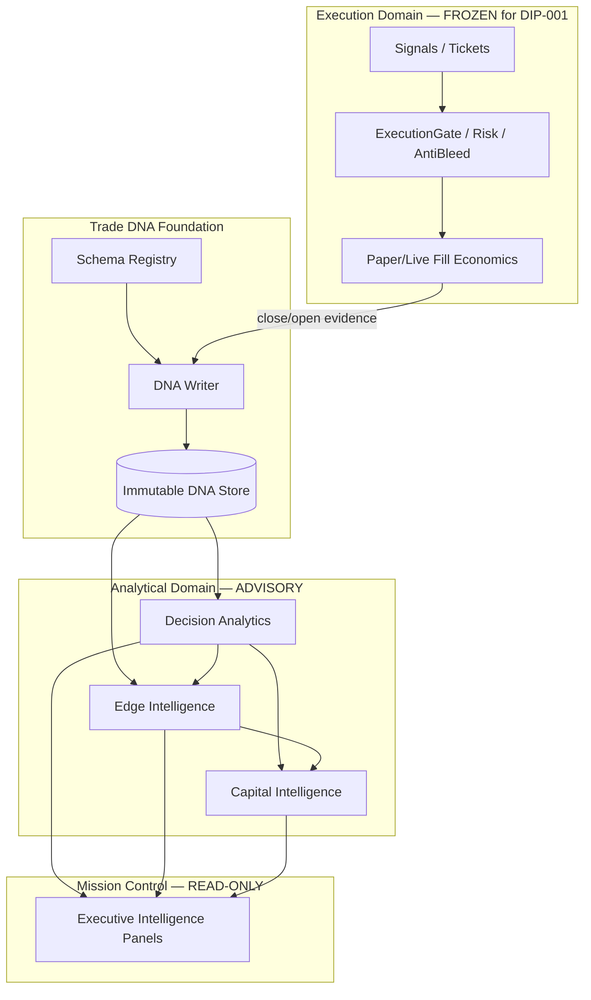

# DIP-001 — Enterprise Decision Intelligence Platform Architecture

**Programme:** CSS Decision Intelligence Platform (DIP)
**Workstream:** DIP-001
**Title:** Decision Intelligence Platform Foundation (Trade DNA + Decision Analytics Foundation)
**Status:** ARCHITECTURE COMPLETE — AWAITING IMPLEMENTATION PHASE AUTHORIZATION
**Repository:** `C:\rasib\source\capital-strata-systems`
**Branch:** `css-v1.0.1-maintenance`
**HEAD (verified):** `c1b2f88b743e31cc94954b4a95b432cd5098183b`
**Date:** 2026-07-30

**Does not authorize:** live trading, OV-002, execution changes, automatic capital movement, desktop interference, or implementation coding without a subsequent DIP implementation workstream.

---

## 1. Objectives

Build **one integrated Decision Intelligence Platform** that:

1. Makes every closed (and eligible open) trade an immutable **Trade DNA** record — the analytical source of truth.
2. Answers institutional questions about **where edge, profit, and loss come from**.
3. Measures **edge strength, stability, decay, and emergence** without touching execution.
4. Produces **recommendation-only** capital-allocation intelligence.
5. Surfaces **executive decision quality** in Mission Control as advisory projections.

DIP consumes existing CSS evidence and analytics surfaces; it does **not** replace ExecutionGate, RiskGovernor, AntiBleedGuard, brokers, or sizing.

---

## 2. Scope

### In scope (architecture)

| Layer | Responsibility |
| --- | --- |
| Trade DNA Foundation | Canonical immutable trade evidence schema + store + versioning |
| Decision Analytics Engine | Profit/loss attribution, expectancy, condition cohorts, strategy trajectory |
| Edge Intelligence Engine | Edge metrics (strength, stability, confidence, decay, emergence, consistency) |
| Capital Intelligence Engine | Advisory allocation / concentration recommendations only |
| Executive Intelligence | Mission Control read-only panels and scorecards |

### Integrate-with (existing CSS — do not replace)

- Trade outcome warehouse / ledger (`trade_outcome_repository`, `trade_outcome_ledger`)
- Canonical trade lifecycle + MW-004 paper execution economics
- Learning pipeline / strategy memory / trade context recorder
- Phase 47A–F quality, explainability, execution quality, forensics
- MC-006 decision intelligence projections
- MC-007A institutional panels
- Phase 174 / 179 / 182A executive intelligence packages
- `advisory_payload` safety lock pattern

### Out of scope / non-goals

- Modifying ExecutionGate, RiskGovernor, AntiBleed, margin, EV thresholds
- Broker adapters, credentials, live enablement
- Position sizing / VolatilityPositionSizer behavior
- Automatic capital reallocation or portfolio rebalancing execution
- Desktop continuous paper runtime
- Rewriting Mission Control runtime contracts beyond **additive advisory panels**
- Inventing fills or prices (DIP reads post-MW-003/004 validated economics)

---

## 3. Architecture overview

```text
                    ┌─────────────────────────────────────────┐
                    │     EXECUTION & RISK (UNCHANGED)        │
                    │  Signal → Gates → Fill/Paper Economics  │
                    └───────────────────┬─────────────────────┘
                                        │ append-only evidence
                                        ▼
┌───────────────────────────────────────────────────────────────────────────┐
│                     TRADE DNA FOUNDATION (immutable SoT)                  │
│  Identity · Execution · Market · Strategy · Risk · Broker · Regime · …    │
│  Outcome · Performance · Governance · Metadata · Evidence hashes          │
└───────────────────────────────────┬───────────────────────────────────────┘
                                    │ read models / feature views
          ┌─────────────────────────┼─────────────────────────┐
          ▼                         ▼                         ▼
┌──────────────────┐    ┌──────────────────┐    ┌──────────────────┐
│ Decision         │    │ Edge             │    │ Capital          │
│ Analytics Engine │    │ Intelligence     │    │ Intelligence     │
│ (attribution,    │    │ (strength,       │    │ (advisory        │
│  expectancy,     │    │  decay,          │    │  allocation      │
│  cohorts)        │    │  emergence)      │    │  recommendations)│
└────────┬─────────┘    └────────┬─────────┘    └────────┬─────────┘
         │                       │                       │
         └───────────────────────┼───────────────────────┘
                                 ▼
                    ┌─────────────────────────────────────────┐
                    │     EXECUTIVE INTELLIGENCE (MC)         │
                    │  Scorecards · Drivers · Research cues   │
                    │  ALWAYS advisory_only / execution false │
                    └─────────────────────────────────────────┘
```

### Design principles

1. **Append-only Trade DNA** — corrections are superseding records or annotations, never silent mutation of committed DNA.
2. **Separation of powers** — analytics never call execution APIs; recommendations never set `execution_allowed=true`.
3. **Evidence first** — every metric cites Trade DNA IDs + schema version + computation version.
4. **Fail-closed advisory** — missing DNA / stale warehouse → UNAVAILABLE / FAIL_CLOSED panels, not invented edge.
5. **Reuse before invent** — map DNA fields onto existing outcome/context/explanation stores where possible; extend schema explicitly.

---

## 4. Component boundaries and interfaces

### 4.1 Trade DNA Foundation

**Owns:** canonical DNA schema, DNA writer (from lifecycle/close events), DNA reader API, immutability/hashing, schema registry.

**Does not own:** order placement, gate decisions, broker connectivity.

**Inbound interfaces:**

- `CanonicalTradeLifecycle` / `TradeRuntimeService` close (and eligible open) events
- MW-004 `execution_economics` payload
- Market/regime snapshots at decision and exit (from existing context recorder / runtime)
- Gate debug summaries (ALLOW/BLOCK reasons, scaled notional, canonical price) as **evidence**, not re-execution

**Outbound interfaces:**

- `TradeDNAStore.get(trade_id)` / `query(filters)` / `stream(since)`
- Schema registry: `dna_schema_version`, field catalog, compatibility rules

### 4.2 Decision Analytics Engine

**Owns:** attribution, expectancy, cohort analysis, strategy trajectory, loss/profit driver tables.

**Consumes:** Trade DNA read models.
**Produces:** analytical result sets with evidence citations (trade_id lists, cohort keys).

### 4.3 Edge Intelligence Engine

**Owns:** edge metric definitions and time-series of edge scores by strategy/instrument/regime.

**Consumes:** DNA + Decision Analytics feature views.
**Produces:** EdgeScorecard records (advisory).
**Forbidden:** changing thresholds, gates, or sizing based on edge scores in DIP-001.

### 4.4 Capital Intelligence Engine

**Owns:** recommendation objects for capital weight / concentration / research attention.

**Produces:** `CapitalRecommendation` with `advisory_only=true`, never portfolio mutation.
**Integrates with:** existing portfolio advisory history patterns.

### 4.5 Executive Intelligence (Mission Control)

**Owns:** read-only projections and panel contracts for DIP scorecards.
**Pattern:** follow MC-006/007A — project, do not authorize.
**Safety:** reuse `advisory_payload` / SAFE_FLAGS conventions.

---

## 5. Component diagram (logical)



---

## 6. Trade DNA proposal

### 6.1 Role

Trade DNA is the **immutable analytical source of truth** for a trade’s identity, context, economics, governance, and outcome. It is denser than the operational `trades` SQLite row and richer than a single outcome warehouse record — those remain operational/warehouse feeds that **project into** DNA.

### 6.2 Schema categories (canonical groups)

Target: a versioned catalog of **hundreds of fields** grouped as follows. DIP-001 architecture freezes the **groups and ownership**; field-level freeze occurs in DIP-002 schema ratification.

| Category | Purpose | Example field families (illustrative, not exhaustive) |
| --- | --- | --- |
| **Trade Identity** | Stable keys | `trade_id`, `session_id`, `dna_id`, `parent_trade_id`, `schema_version`, `dna_hash` |
| **Execution** | What was intended vs filled | `side`, `order_type`, `requested_qty`, `filled_qty`, `requested_notional`, `scaled_notional`, `entry_price`, `exit_price`, `fill_kind`, `slippage_bps`, `fees`, `latency_ms` |
| **Market Context** | State at entry/exit | symbol, asset_class, venue, session, timezone, spread, depth proxies, holiday flags |
| **Strategy** | Who decided | `strategy_id`, engine_mode, signal_id, confluence scores, model versions |
| **Risk** | Risk posture | stop distance, risk_pct, drawdown context, AntiBleed net edge inputs, margin state |
| **Broker** | Broker identity | broker_name, broker_mode, account mode, practice vs live flags (never secrets) |
| **Liquidity** | Tradability | spread regime, volume proxies, gap flags |
| **Volatility** | Vol context | realized vol, vol_mult, ATR proxies, vol regime label |
| **Regime** | Macro/micro regime | trend/range, risk-on/off, session regime, persistence |
| **Indicators** | Feature snapshot | indicator bag (named, versioned); nulls allowed; no recompute mutation |
| **Timing** | Temporal structure | open/close timestamps, holding seconds, TOD/DOW bins, time-to-stop |
| **Governance** | Control plane | gate final/reason, unified trade gate reason, kill-switch state, advisory flags |
| **Outcome** | Result labels | win/loss, MFE/MAE, exit reason, partial flags |
| **Performance** | Derived PnL metrics | realized_pnl, R-multiple, expectancy contribution, amount_traded |
| **Metadata** | Provenance | writers, source artifacts, evidence URIs, computation_ids, created_at |

### 6.3 Immutability rules

1. A committed DNA record is **append-only**.
2. Corrections → new DNA revision with `supersedes_dna_id` + reason code (never overwrite hash).
3. Derived analytics store **results separately** keyed by `dna_id` + `metric_version`.
4. Secrets/credentials **never** enter DNA.
5. Missing fields are explicit `null` / `UNAVAILABLE` with provenance — not invented defaults (`0`, `1`, fake prices).

### 6.4 Storage model

| Store | Role |
| --- | --- |
| Operational `trades` table | Runtime open/close; MW-004 economics in `raw_payload_json` |
| Outcome warehouse / ledger | Completed-trade analytics feed (existing) |
| **Trade DNA store** (new) | Normalized immutable DNA documents (JSON/Parquet/SQLite extension — implementation choice in DIP-002) |
| Metric marts | Materialized Decision/Edge/Capital result tables (rebuildable) |

**Recommended DIP-002 choice:** versioned JSON documents + content hash, with optional columnar export for research — without changing execution DB semantics.

### 6.5 Evidence / replay model

- Each DNA record cites source event IDs (lifecycle close, gate summary, context snapshot).
- Replay = recompute **analytics** from immutable DNA + metric_version; never re-fire live orders.
- Session replay exporters remain evidence exporters; DNA becomes the preferred analytical join key.

---

## 7. Decision Analytics proposal

### 7.1 Questions answered

| Question | Analytical product |
| --- | --- |
| Where did profits come from? | PnL attribution by strategy, regime, instrument, TOD, broker_mode |
| Where did losses come from? | Loss concentration / tail cohorts |
| Which conditions repeatedly outperform? | Condition expectancy heatmaps (regime × vol × session) |
| Best expectancy entries? | Entry-feature cohorts with sample-size floors |
| Which exits destroy value? | Exit-reason / MAE-path degradation analysis |
| Strategies improving vs degrading? | Rolling expectancy / hit-rate / R-multiple trajectories |

### 7.2 Method (high level)

1. Build feature views from DNA (entry/exit slices).
2. Apply **minimum sample** and **stability** gates before claiming edge.
3. Emit ranked tables with confidence intervals or bootstrap bands where practical.
4. Attach evidence lists (`trade_id`s) for every claim shown in MC.

### 7.3 Non-behavior

Does not alter gates, sizing, or strategy selection automatically.

---

## 8. Edge Intelligence proposal

### 8.1 Metrics (definitions to be ratified in DIP-003)

| Metric | Intent |
| --- | --- |
| **Edge Strength** | Magnitude of expectancy / R-multiple vs baseline |
| **Edge Stability** | Dispersion / regime-conditional variance of strength |
| **Confidence** | Sample size + stability-adjusted confidence score |
| **Decay** | Negative slope of rolling expectancy |
| **Emergence** | Positive slope from near-zero baseline with rising confidence |
| **Consistency** | Fraction of periods with positive expectancy |

### 8.2 Isolation rule

Edge scores are **observational**. DIP-001 forbids wiring Edge Intelligence into ExecutionGate, RiskGovernor, or capital movement.

---

## 9. Capital Intelligence proposal

### 9.1 Outputs (recommendation-only)

- Suggested research attention weights by strategy/instrument
- Concentration warnings (overexposure to decaying edge)
- Diversification opportunities (emerging edges with confidence floors)

### 9.2 Hard constraints

```text
advisory_only = true
execution_allowed = false
capital_movement = NEVER
live_trading_blocked = true
```

Align with `backend/common/advisory_payload.py` and portfolio advisory history stores.

---

## 10. Executive Intelligence proposal (Mission Control)

### 10.1 Additive panels (read-only)

| Panel | Content |
| --- | --- |
| Decision Quality | Gate/governance quality proxies + DNA completeness |
| Execution Quality | Slippage/fill fidelity vs DNA execution block (reuse 47C concepts) |
| Capital Efficiency | PnL per unit risk / per scaled notional |
| Top Profit Drivers | Ranked cohorts from Decision Analytics |
| Largest Loss Drivers | Ranked loss cohorts |
| Strongest Edge | Edge Intelligence leaders |
| Weakest Edge | Edge Intelligence laggards / decay alerts |
| Research Opportunities | Capital Intelligence recommendations |

### 10.2 Integration style

- Follow MC-006 projection pattern: build from warehouse/DNA; never execute.
- Ban BUY/SELL/EXECUTE language in recommendation text (existing MC safety).
- Fail-closed to UNAVAILABLE when DNA coverage is insufficient.

---

## 11. Governance model

| Control | Rule |
| --- | --- |
| Program gate | DIP implementation requires explicit workstream authorization after this architecture |
| Code freeze (DIP-001) | Architecture only — no production execution edits |
| Advisory lock | All DIP outputs carry fail-closed advisory flags |
| Schema governance | DNA schema versions registered; breaking changes require DIP schema RFC |
| Evidence custody | DNA hashes + metric versions retained per existing evidence custody norms |
| Live trading | Unchanged — **LIVE_TRADING_NOT_AUTHORIZED** by DIP |
| Desktop runtime | Untouched |

---

## 12. Implementation roadmap

| Phase | Name | Deliverable |
| --- | --- | --- |
| **DIP-001** | Architecture (this document) | Boundaries, schema categories, governance |
| **DIP-002** | Trade DNA Foundation | Schema ratification, writer from lifecycle, store, hash, tests |
| **DIP-003** | Decision Analytics v1 | Attribution + expectancy + cohort APIs + tests |
| **DIP-004** | Edge Intelligence v1 | Edge scorecards + decay/emergence + tests |
| **DIP-005** | Capital Intelligence v1 | Advisory recommendations + history + tests |
| **DIP-006** | Executive Intelligence MC | Panels/projections wired to MC contracts |
| **DIP-007** | Certification | Deterministic regression + advisory safety certification |

### Recommended implementation order

1. **DIP-002 Trade DNA** — without immutable SoT, analytics will continue to fragment.
2. **DIP-003 Decision Analytics** — answers institutional “why PnL” questions.
3. **DIP-004 Edge Intelligence** — depends on stable cohorts from DNA/analytics.
4. **DIP-005 Capital Intelligence** — recommendation-only, after edge confidence exists.
5. **DIP-006 Executive MC panels** — present after backends are evidence-backed.
6. **DIP-007 Certification** — lock advisory fail-closed and non-interference with execution.

---

## 13. Risks and mitigations

| Risk | Mitigation |
| --- | --- |
| Schema sprawl (hundreds of fields) | Category freezes first; field catalogs versioned; optional fields default UNAVAILABLE |
| Duplicate analytics engines | Explicit “integrate-with” map; DIP reads adapters over Phase 47/126/128/179 |
| Silent coupling to execution | CI/governance bans DIP imports from sizing/gate mutation paths |
| Fake completeness | Coverage metrics on DNA; MC shows UNAVAILABLE when thin |
| Paper vs live DNA pollution | `broker_mode` / authority flags mandatory; separate cohorts |

---

## 14. Success criteria (program-level)

1. Every certified paper/live close can emit a hashed Trade DNA record.
2. Decision Analytics can answer profit/loss driver questions with cited trades.
3. Edge scores exist without any execution code change.
4. Capital recommendations remain non-executing.
5. Mission Control shows DIP panels as advisory-only.
6. Execution/risk/broker suites remain green and unmodified by DIP.

---

## 15. Final recommendation

**ARCHITECTURE_READY_FOR_DIP_002**

Next authorized step (when approved): **DIP-002 Trade DNA Foundation implementation** — schema ratification + immutable writer/store only.

No code in DIP-001. No commit required for this architecture phase unless operators choose to land the governance document via a separate docs workstream.

---

*End of DIP_001_ENTERPRISE_DECISION_INTELLIGENCE_ARCHITECTURE.md*
