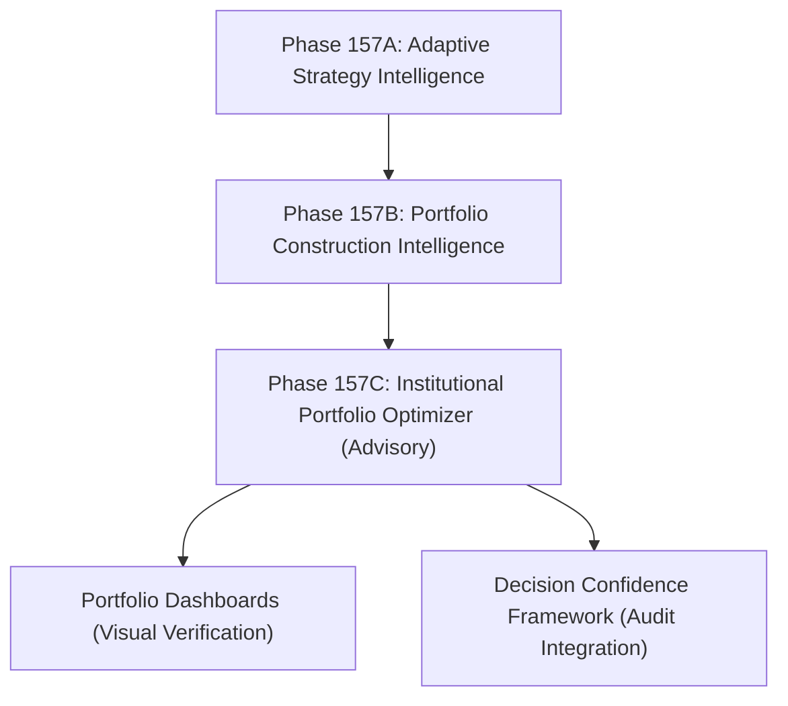

# Phase 157C – Institutional Portfolio Optimizer

## Purpose

The **Institutional Portfolio Optimizer** generates multiple optimized portfolio candidates representing different institutional risk profiles and objectives from already-approved opportunities. This is an advisory-only component designed to help operators evaluate alternative portfolio structures, understand risk-return tradeoffs, and explore the advisory efficient frontier.

> [!IMPORTANT]
> **Advisory-Only Policy Constraint:**
> This component generates advisory institutional portfolio scenarios only. It **NEVER** authorizes execution, changes trading authority, or alters live capital allocation budgets.
> - `advisory_only` is strictly locked to `True`.
> - `execution_allowed` is strictly locked to `False`.
> - `live_trading_blocked` is strictly locked to `True`.
> - `broker_execution_armed` is strictly locked to `False`.

---

## Scenario Definitions

Phase 157C generates six distinct portfolio configurations:

1. **Conservative**: Optimizes for the lowest drawdown and highest resilience score, minimizing downside risk.
2. **Balanced**: Balances risk and return using the overall portfolio quality score.
3. **Growth**: Optimizes for the maximum expected return.
4. **Income**: Prioritizes stable cash-flow / carry (favoring fixed income, FX, and carry strategies).
5. **High Sharpe**: Optimizes for the maximum risk-adjusted return (Sharpe ratio).
6. **High Sortino**: Optimizes for the maximum downside-adjusted return (Sortino ratio).

---

## Optimization Methodology & Efficient Frontier

The optimization engine uses combinatorial analysis over the set of approved opportunities. It evaluates all valid portfolio subsets between `min_positions` (default 1) and `max_positions` (default 5) using the canonical `PortfolioResilienceAnalyzer`.

### Pareto-Optimal Efficient Frontier

An advisory efficient frontier is constructed by identifying portfolios for which no other portfolio dominates both expected return and expected risk (volatility):
- A portfolio is on the frontier if there is no other portfolio with a higher return and lower or equal risk.
- Efficient portfolios are ranked by Return, Risk, Efficiency (Sharpe/Sortino), and Resilience to provide clear insights.

---

## Trade-off Analysis

The trade-off analyzer performs pairwise comparisons between portfolios (e.g. comparing all profiles to the Balanced profile). It produces natural language explanations of the exact trade-offs:
- **Risk/Return Tradeoff**: Growth increases expected return but increases expected drawdown.
- **Resilience Tradeoff**: Income/Conservative improves resilience and downside protection at the expense of return.
- **Efficiency Improvements**: High Sharpe and High Sortino optimize risk-adjusted metrics over the default Balanced setup.

---

## Relationship to Other Phases

1. **Phase 157A (Adaptive Strategy Intelligence)**: Evaluates strategy profitability and feeds confidence weights to the portfolio builder.
2. **Phase 157B (Portfolio Construction Intelligence)**: Selects a preferred portfolio from approved opportunities.
3. **Phase 157C (Institutional Portfolio Optimizer)**: Extends Phase 157B by generating multiple alternative portfolios representing different institutional objectives.
4. **Decision Confidence**: The metrics computed for each portfolio (e.g., Sharpe, Sortino, resilience, capital efficiency) are shared with the Decision Confidence Framework for audit validation.
5. **Portfolio Dashboards**: Exposes the advisory portfolios, trade-off explanations, and efficient frontier rankings to operators via the UI.
