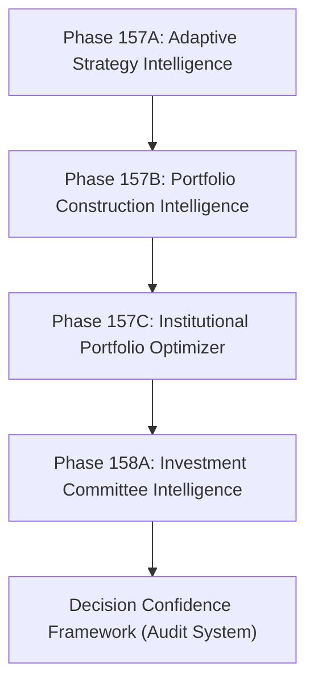

# Phase 158A – Institutional Investment Committee Intelligence

## Purpose

The **Institutional Investment Committee Intelligence** system simulates an institutional investment committee that evaluates advisory portfolio recommendations from multiple professional viewpoints. This ensures transparent, collaborative evaluation before any decisions are exposed to downstream operators.

> [!IMPORTANT]
> **Advisory-Only Policy Constraint:**
> This phase produces advisory committee recommendations only. It **NEVER** authorizes execution, modifies downstream execution authority, or alters live trading decisions.
> - `advisory_only` is strictly locked to `True`.
> - `execution_allowed` is strictly locked to `False`.
> - `live_trading_blocked` is strictly locked to `True`.
> - `broker_execution_armed` is strictly locked to `False`.

---

## Committee Architecture & Member Profiles

The committee simulates six institutional roles with distinct analytical biases:

1. **Chief Investment Officer (CIO)**:
   - *Responsibilities*: Long-term portfolio quality, capital efficiency, and strategic allocation.
   - *Biases*: Prioritizes overall portfolio quality score and capital efficiency.
2. **Chief Risk Officer (CRO)**:
   - *Responsibilities*: Expected drawdown, volatility, concentration, tail risk, and resilience.
   - *Biases*: Sensitive to high expected drawdown, volatility, concentration, and broker infrastructure status.
3. **Portfolio Manager (PM)**:
   - *Responsibilities*: Expected return, diversification, and opportunity quality.
   - *Biases*: Highly values expected returns and asset diversification.
4. **Head of Trading**:
   - *Responsibilities*: Execution practicality, liquidity, slippage, and timing.
   - *Biases*: Sensitive to broker health indicators and individual opportunity liquidity scores.
5. **Quantitative Research Lead**:
   - *Responsibilities*: Statistical edge, confidence, and model robustness.
   - *Biases*: Strongly respects numerical model confidence metrics (Decision Confidence).
6. **Governance & Compliance**:
   - *Responsibilities*: Policy adherence, execution boundaries, and governance verification.
   - *Biases*: Votes `Reject` if execution is enabled or advisory boundaries are bypassed.

---

## Voting & Consensus Algorithm

### Voting Categories

Each member scores the target portfolio across 9 dimensions out of 100. The average score maps to a vote:
- **Strong Approve** or **Approve**: Maps to the `approve` tally.
- **Conditional Approve** or **Needs Review**: Maps to the `conditional` tally.
- **Reject**: Maps to the `reject` tally.

### Consensus Rules

The `CommitteeConsensusEngine` aggregates member votes and determines the overall status:
- **REJECT**: Triggered if **any** member votes `Reject` (e.g. Compliance due to policy breach, or CRO due to extreme risk).
- **NEEDS_REVIEW**: Triggered if there are no rejects, but there are more than 2 `conditional` votes.
- **CONDITIONAL**: Triggered if there are no rejects and between 1 and 2 `conditional` votes.
- **APPROVE**: Triggered if the majority of votes are `approve` with zero rejects/conditionals.

---

## Explainability

The `CommitteeExplainability` engine translates the numerical evaluations and votes of each member into natural language sentences. These comments capture specific feedback:
- CRO recommendations to reduce concentration.
- CIO preferences based on portfolio quality.
- Quant Lead confidence flags based on statistical evidence.
- Compliance verification of execution boundaries.

---

## Relationship to Other Phases

1. **Adaptive Strategy Intelligence (Phase 157A)**: Feeds strategy edge indicators to the evaluation.
2. **Portfolio Construction Intelligence (Phase 157B)**: Provides the preferred portfolio structure.
3. **Institutional Portfolio Optimizer (Phase 157C)**: Generates the scenario candidates and efficient frontier that the committee evaluates.
4. **Decision Confidence Framework**: Integrates with the committee by providing confidence metrics and consuming the consensus rating for audit trails.
