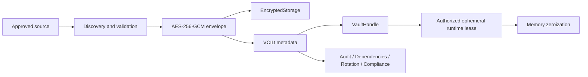
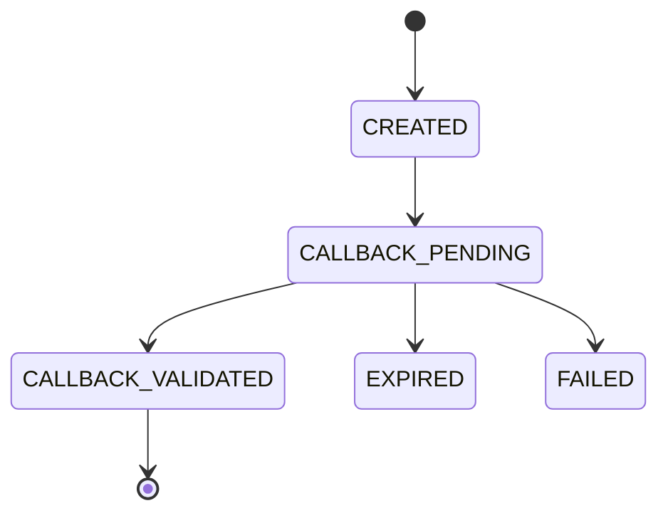
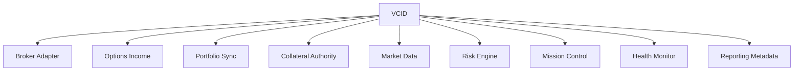

# Phase 178E — Enterprise Credential Governance

## Executive summary

Phase 178E establishes ESMS-001 (Enterprise Secret Management Standard) and
ESMS-002 (Credential Dependency and Impact Mapping) as source-only,
broker-independent governance foundations. It does not authenticate a broker,
perform OAuth, expose callback endpoints, contact a provider, or grant
execution authority.

All credential material enters the vault as mutable binary data, is encrypted
immediately with AES-256-GCM, and is retained only as authenticated ciphertext.
Inventory, reports, Mission Control, audit, dependency mapping, certification,
and backup surfaces contain metadata only.

## Vault architecture

The encryption key is supplied through an `EncryptionKeyProvider`. The vault
never writes it beside encrypted records. Production onboarding must bind that
provider to an OS-backed secret facility or enterprise KMS. The included static
provider exists for deterministic tests and dependency injection only.

File storage uses one encrypted JSON record per VCID and atomic replacement.
Deletion performs a best-effort overwrite before unlinking; storage-device
wear-leveling means cryptographic erasure through key retirement remains the
required production guarantee.

## ESMS-001

ESMS-001 controls implemented:

- AES-256-GCM authenticated encryption with unique 96-bit nonces.
- Canonical metadata-bound additional authenticated data.
- HMAC-SHA256 credential fingerprints, not raw secret hashes.
- Integrity and corruption detection before runtime use.
- Opaque metadata-only handles; there is no generic `GetSecret()` API.
- Explicit consumer authorization and handle/consumer binding.
- Ephemeral mutable runtime leases with best-effort zeroization.
- Encrypted-record-only backups and signed manifest metadata.
- Rotation, expiry, refresh, validation, health, and audit metadata.
- Recursive report and UI redaction for credential-bearing fields and values.
- Execution remains blocked.

Canonical IDs follow:

`VCID-BRK-<BROKER_CODE>-<SEQUENCE>`

Example: `VCID-BRK-QT-000001`.

Each record tracks broker, credential type, classification, creation/update
times, rotation policy, expiry, owner, health, audit ID, validation history,
fingerprint, encryption status, least-privilege status, and version.

## Credential discovery and migration

`CredentialDiscovery` scans only explicitly approved source mappings. Matching
values are validated in memory, copied into mutable buffers, encrypted and
registered, then zeroized. The migration result contains only VCIDs and
`vault-handle:` runtime references. Original configuration sources are retained
in Phase 178E and a migration report is produced; deletion is deliberately
deferred.

No discovery runs automatically at import or startup.

## Secure-handle model

Issuance requires the target consumer to be pre-authorized in `VaultPolicy`.
The handle contains VCID, HMAC fingerprint, capability, consumer identity, and
a random nonce. Runtime access verifies all bindings before decryption. The
lease cannot be serialized by vault APIs and its backing buffer is overwritten
when the context closes.

## OAuth framework

The framework provides offline PKCE preparation, hashed authorization state,
expiry, exact callback binding, HTTPS enforcement, allowlisting, and one-time
state consumption. Replay attempts fail closed. It provides no HTTP callback
route, browser launch, token exchange transport, or provider-specific network
logic.

## Token lifecycle

Token metadata supports `CREATED`, `VALIDATED`, `ROTATING`, `EXPIRED`,
`REVOKED`, `HEALTHY`, `DEGRADED`, and `FAILED`. The refresh planner reports
whether refresh is due but always returns `refresh_allowed=false` and
`network_call_performed=false` in this phase.

## ESMS-002 dependency graph

The reverse graph records service tier, whether the credential is required,
pause safety, and rollback support. Phase 178E does not modify Health Checker;
`Health Monitor` is modeled only as a possible future dependency label.

## Rotation impact

Before rotation, impact analysis identifies affected services, estimated
downtime, pause blockers, safe/blocked outcome, and rollback availability.
Required consumers that cannot safely pause block rotation outside an approved
maintenance window. Replacement material is encrypted before the active record
version changes.

## Audit

Every vault operation records timestamp, operator, service, broker, VCID,
correlation ID, action, success/failure, and reason code. The schema has no
free-form details or secret-value field. Audit serialization applies the
credential redaction policy.

## Mission Control

`/mission-control/credential-governance` is an administrator-only, metadata-only
page. It shows vault health, credential inventory, rotation queue, expiring
credentials, audit events, dependencies, compliance, and selected-credential
metadata. It is registered as an explicit page while preserving the established
16-item primary navigation contract.

No runtime was restarted for this source phase, so no served-page screenshot
was captured. Source rendering is covered by focused tests.

## Report redaction

Enterprise paginated report formatting now recursively redacts API keys, OAuth
codes, refresh/access tokens, client secrets, private keys, passwords,
certificates, account numbers, authorization headers, bearer values, and PEM
blocks before formatting.

## Compliance readiness

The certification projection maintains future evidence for:

- ISO 27001: encryption, access policy, rotation, audit, asset inventory.
- SOC 2: logical access, change evidence, confidentiality, monitoring metadata.
- NIST CSF: Identify/Protect/Detect/Respond/Recover mappings.

Certification includes last validation, rotation compliance, encryption
status, least privilege, consumer inventory, integrity, and execution-block
evidence.

## Safety certification

- Advisory only: **confirmed**
- Live trading enabled: **no**
- Broker authentication attempted: **no**
- OAuth performed: **no**
- Broker network calls: **none**
- Callback endpoints exposed: **none**
- CSS restarted: **no**
- Health Checker modified: **no**
- Secrets written to source, reports, logs, or Git: **no**
- Staged, committed, or pushed: **no**

## Remaining production work

1. Bind `EncryptionKeyProvider` to an approved OS secret store or enterprise KMS.
2. Select an approved encrypted-record storage backend and cryptographic-erasure policy.
3. Establish operator/maker-checker authorization for discovery and rotation.
4. Populate the dependency graph from certified runtime ownership records.
5. Complete an external cryptographic and compliance review.
6. Activate broker onboarding only in a separately approved phase.
